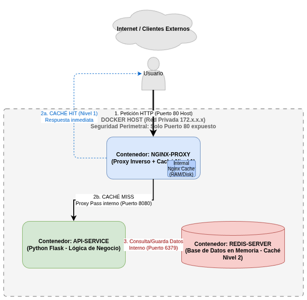

Descripción:
Con este repositorio vamos a hacer un proxy inverso usando Docker. Se necesita una API en Flask, una base de datos en Redis y un proxy inverso utilizando Nginx.

Diagrama:

Instrucciones de Despliegue:
sudo apt install git
git clone https://github.com/dgaldel1008/practica_seguridad.git

cd practica_seguridad

sudo apt update

sudo apt install apt-transport-https ca-certificates curl software-properties-common

curl -fsSL https://download.docker.com/linux/ubuntu/gpg | sudo apt-key add -

sudo add-apt-repository "deb [arch=amd64] https://download.docker.com/linux/ubuntu $(lsb_release -cs) stable"

sudo apt update

sudo apt install docker-ce

sudo docker --version

sudo curl -L "https://github.com/docker/compose/releases/download/$(curl -s https://api.github.com/repos/docker/compose/releases/latest | jq -r .tag_name)/docker-compose-$(uname -s)-$(uname -m)" -o /usr/local/bin/docker-compose

sudo chmod +x /usr/local/bin/docker-compose

docker-compose --version

sudo docker-compose up --build

Pruebas:
curl -i http://localhost

curl -i http://localhost

